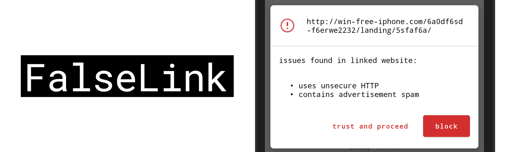
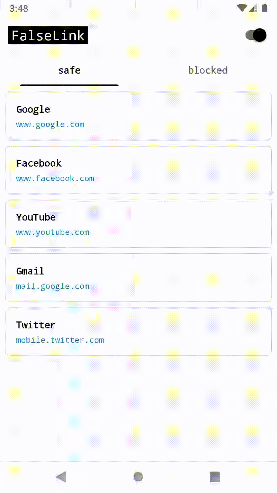

FalseLink
=========

Everyday we encounter numerous weblinks across various apps ranging from social media to email, most of which are shortened URLs and hyper-linked texts, making it impossible to know where they might lead to. Some malicious weblinks are even disguised with legitimate website names to trick the average user. The internet is indeed a boon. But it is fair to say that for the average user, the internet is a black box and bad actors take advantage of this, whether it be stealing personal information, mining crypto-currencies or promoting illicit content.

A safe web experience should begin even before the user visits a website. When the user tries to open a suspicious weblink on any app, FalseLink intercepts to verify the content and credibility of the website it leads to and informs the user before he opens it in a browser.

To achieve this, FalseLink uses 2 stages of verification:
1. Malicious URL detection - Detect phishing URLs and repeated redirecting URLs.
2. Web content classification - Extract and determine the content of a website using Text/Image classification. (adult content, illegal betting websites, advertising spams etc.)

Existing solutions either requires the user to continually share their browsing information with 3rd parties or simply black-lists websites that are considered to be known bad-actors. Leveraging on-device machine learning enables us to perform low-latency-real-time verification on the device without ever having to share the user’s browsing information.

**Demo and Project Overview** : [https://www.youtube.com/watch?v=EfTHhnq321E](https://www.youtube.com/watch?v=EfTHhnq321E)

**AndroidDevChallenge submission** (Please download and view since GitHub may not render some pages in the pdf.) : [WTLCoverLetter.pdf](submission/WTLCoverLetter.pdf), [WTLCoverLetter.docx](submission/WTLCoverLetter.docx) 

Screens (GIF)
-------
* Verification step has been mocked for demonstration purposes.

  

License
-------
    Copyright 2019 Chandramohan Sudar

    Licensed under the Apache License, Version 2.0 (the "License");
    you may not use this file except in compliance with the License.
    You may obtain a copy of the License at

       http://www.apache.org/licenses/LICENSE-2.0

    Unless required by applicable law or agreed to in writing, software
    distributed under the License is distributed on an "AS IS" BASIS,
    WITHOUT WARRANTIES OR CONDITIONS OF ANY KIND, either express or implied.
    See the License for the specific language governing permissions and
    limitations under the License.

